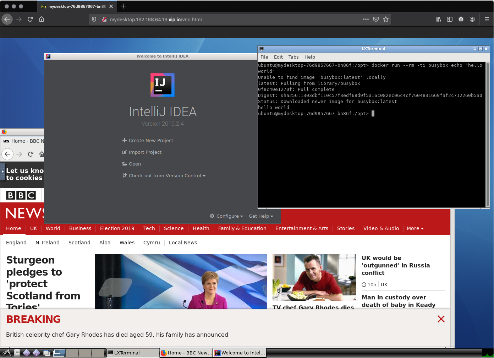

#  💻  ☸️  🛠 (VDI in Kubernetes POC)

> VDI = Virtual Desktop Infrastructure




## What this POC does:

- [Build](./Dockerfile) and [Deploy](./kube) a ubuntu based container with a gui, and some dev tools in it
- Target infra is [minikube](https://github.com/kubernetes/minikube) for demo
- Provides a http endpoint for the desktop, that can be accessed in a browser
- Sidecar [docker-in-docker](https://www.docker.com/blog/docker-can-now-run-within-docker/) so the dev can do docker builds/runs and such in their machine, perhaps even deploy [KIND](https://github.com/kubernetes-sigs/kind) and then maybe deploy this VDI in that, and cause the universe to explode with the levels of inception 🤯 - I didn't try that.

## What this POC **doesn't do** *(oh boy)*

- **auth**, I figured this would happen with a [JWT](https://jwt.io/) being issued by something like [keycloak](https://www.keycloak.org/) wired up to the AD, and then use sidecar [proxy](https://github.com/keycloak/keycloak-gatekeeper) pattern to bounce requests before they hit the gui container
- **least privilege**, I started looking into things like [dind:rootless](https://engineering.docker.com/2019/02/experimenting-with-rootless-docker/) and making the gui run without privilage, but I didn't polish any of that, so haven't committed it
- **persistence**, easy to solve but I've not thought about providing user workspaces for them to put their code
- **scheduling**, we don't really need the containers running all the time, so something like [kube-downscaler](https://github.com/hjacobs/kube-downscaler) could be used to turn off machines out of working hours
- **scaling**, this will be an interesting one, and maybe require a custom scheduler, it'll be a bit like [knative](https://knative.dev/) in that it'd be event driven; it'll need to startup and keep alive one vdi pod per unique userid based on the JWT token
- **notifications**, probably want someway to signal to the user that you're de/rescheduling their vdi, so give them a chance to save their work before it goes bye bye
- **healthchecks**, right now it checks if the webserver for [novnc](https://novnc.com/) is running, but it could probably check a bit more like if x is running so that scheduler can restart it when it fails
- [**rhel**](https://www.redhat.com/en/technologies/linux-platforms/enterprise-linux) people like RHEL, I made this work in ubuntu because it was the path of least resistance though it could be readily refactored to centos/rhel based
- **graphics**, I've not got any hardware acceleration, given the use case this is probably ok
- **audit**, vnc is easy to record, so something like [vncproxy](https://github.com/amitbet/vncproxy) or [vnc-recorder](https://github.com/saily/vnc-recorder) operating in a sidecar would be a good fit
- **transit security**, another sidecar process with the tls certs would be fine for this for internal tls within the kubernetes cluster

## [Run](./bootstrap.sh)

```bash
./bootstrap.sh
```

Tested on my macbook, this should hopefully start up minikube, build the docker image in the minikube docker daemon, run a single deployment, then open a browser showing the whole thing 🤞